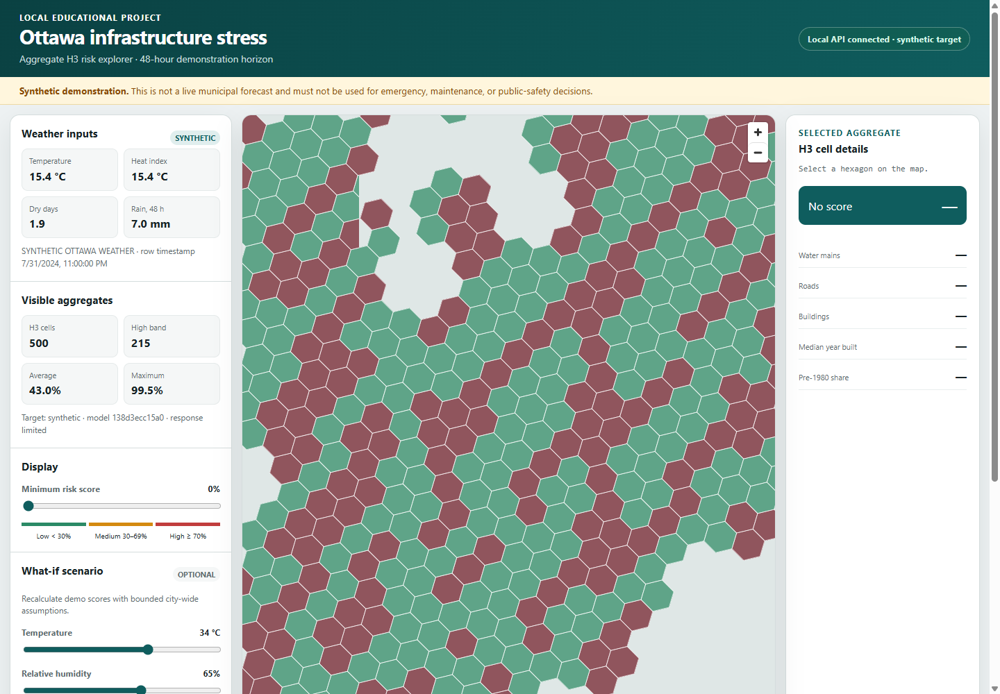

# Ottawa Summer Infrastructure Stress Predictor

[](https://github.com/dev856/ottawa-infra-stress/actions/workflows/ci.yml)
[](https://www.python.org/downloads/)
[](tests/)
[](https://github.com/astral-sh/ruff)
[](https://mypy-lang.org/)
[](LICENSE)
[](https://lightgbm.readthedocs.io/)
[](https://h3geo.org/)

An educational geospatial machine learning system that models and predicts **48-hour water main break vulnerability** across Ottawa neighborhoods using Uber H3 hexagonal grids, weather interaction features, and gradient-boosted classification.



> **Simulation Notice:** This project is an educational engineering simulation. By default, it operates on deterministic synthetic training data and mock municipal infrastructure layers, allowing 100% offline, privacy-safe, and reproducible execution. It is not an operational municipal emergency dispatch tool.

---

## 🏛️ Problem Domain: Summer Infrastructure Stress

While winter freeze-thaw cycles are well known, **summer heatwaves and drought conditions create major underground infrastructure stress** in the Ottawa region due to three interconnected factors:

1. **Leda Clay Ground Movement:** Much of Ottawa is situated on sensitive marine clay (*Leda clay*). During prolonged summer heatwaves, the soil loses moisture and shrinks. When sudden rain follows, it expands. This cyclic ground settlement exerts strong bending and shear forces on buried pipe networks.
2. **Pre-1980 Vintage Infrastructure:** Legacy unlined cast-iron and early ductile-iron pipes installed before 1980 have lower tensile flexibility and are more brittle under ground settlement.
3. **Surging Water Demand:** High temperatures and heatwaves drive peak municipal pumping pressures for commercial cooling, residential lawn irrigation, and civic use.

---

## 🏗️ Architecture & Technology Stack

```text
┌────────────────────────────────┐      ┌───────────────────────────────┐
│   Environment Canada Weather   │      │   City of Ottawa Vector GIS   │
│   (Hourly Historical/Simulated)│      │   (Pipes, Roads, Buildings)   │
└────────────────┬───────────────┘      └───────────────┬───────────────┘
                 │                                      │
                 ▼                                      ▼
    ┌─────────────────────────┐            ┌─────────────────────────┐
    │ Weather Feature Pipeline│            │ Spatial Join & H3 Grid  │
    │ (Heat Index, Dry Days)  │            │ (Uber H3 Res 8 Hexagons)│
    └────────────┬────────────┘            └────────────┬────────────┘
                 │                                      │
                 └──────────────────┬───────────────────┘
                                    │
                                    ▼
                     ┌─────────────────────────────┐
                     │ LightGBM Classifier Pipeline│
                     │ (48-hr Vulnerability Risk)  │
                     └──────────────┬──────────────┘
                                    │
                                    ▼
                     ┌─────────────────────────────┐
                     │     FastAPI REST Engine     │
                     │ (/risk-map, /risk/{h3_index})│
                     └──────────────┬──────────────┘
                                    │
                                    ▼
                     ┌─────────────────────────────┐
                     │ MapLibre GL JS Web Dashboard│
                     │ (Local Themes & Simulator)  │
                     └─────────────────────────────┘
```

- **Backend & ML**: Python 3.11+, LightGBM, Scikit-Learn, Pandas, NumPy
- **Geospatial Processing**: Uber H3 (`h3-py`), GeoPandas, Shapely, PostGIS (optional)
- **API Engine**: FastAPI, Uvicorn, Pydantic v2
- **Frontend Dashboard**: MapLibre GL JS, Vanilla CSS3 / HTML5 (No external tile dependencies)
- **Testing & Quality**: Pytest, Pytest-Cov (100+ tests, ≥74% coverage), Ruff, MyPy

---

## 🚀 Quickstart

### 1. Clone & Setup Environment

```bash
# Clone the repository
git clone https://github.com/dev856/ottawa-infra-stress.git
cd ottawa-infra-stress

# Create and activate virtual environment
python -m venv .venv
source .venv/bin/activate    # On Windows: .venv\Scripts\Activate.ps1

# Install dependencies
pip install -r requirements.txt -r requirements-dev.txt
```

### 2. Configure Environment

```bash
# Copy example configuration
cp .env.example .env         # On Windows: copy .env.example .env
```
*(Default settings use `DATA_SOURCE_MODE=mock`, allowing full pipeline execution with zero external network or database dependencies.)*

### 3. Run Pipeline & Train Model

```bash
python run_pipeline.py
```
This executes the end-to-end pipeline: generates the Ottawa H3 grid (3,361 cells), computes weather features, aggregates spatial building and pipe densities, trains the LightGBM classifier, and outputs verified model artifacts to `data/` and `models/`.

### 4. Start the Application

```bash
# Launch FastAPI backend & integrated static dashboard
python -m uvicorn api.main:app --host 127.0.0.1 --port 8000
```
Open **[http://127.0.0.1:8000](http://127.0.0.1:8000)** in your browser.

---

## 📊 Dashboard Features

- **Interactive Risk Hexagons**: Visualizes 48-hour infrastructure stress across Ottawa at Uber H3 Resolution 8 (~0.73 km² per neighborhood block).
- **📍 Quick-Jump Bookmarks**: Jump directly between iconic Ottawa zones (*Downtown Core*, *Kanata Suburbs*, *Orléans East*, *Nepean / Greenbelt*).
- **🎛️ Real-Time What-If Scenario Simulator**: Adjust temperature, relative humidity, and consecutive dry days on the fly to see the ML model re-evaluate spatial risk in milliseconds.
- **🎨 4 Local Canvas Themes**: Fast, privacy-respecting vector map styles (*Neutral Light*, *Dark Canvas*, *Muted Slate*, *Terrain Tint*) that make zero third-party tile requests.
- **📈 Granular Cell Breakdown**: Inspect individual hexagon metrics: linear water main kilometers, road network length, building counts, median construction vintage, and pre-1980 building shares.

---

## 🔌 API Reference

| Method | Endpoint | Description |
| :--- | :--- | :--- |
| `GET` | `/health` | Service liveness and operational health probe |
| `GET` | `/weather-summary` | Latest environmental and temperature parameters |
| `GET` | `/metrics` | LightGBM model performance metadata and decision thresholds |
| `GET` | `/risk-map` | GeoJSON feature collection of visible H3 cells within a validated Ottawa bounding box |
| `GET` | `/risk/{h3_index}` | Detailed spatial and vintage feature breakdown for a specific H3 cell |

Interactive Swagger documentation is available at `http://127.0.0.1:8000/docs`.

---

## 🧪 Testing & Verification

Run the full automated test suite (including unit tests, integration tests, and frontend compliance checks):

```bash
# Run pytest with test coverage
python -m pytest -q --cov=src --cov=api --cov-report=term-missing

# Run code linter
python -m ruff check src/ tests/ api/

# Run static type checker
python -m mypy src/ api/ --ignore-missing-imports
```

---

## 📄 License

This project is open-source under the MIT License.
